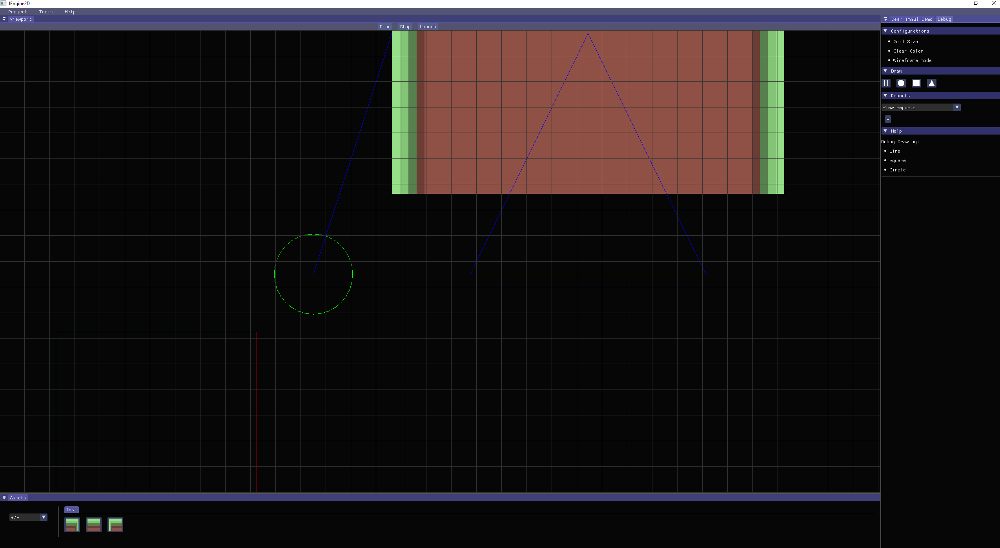

## THIS IS NO LONGER BEING WORKED ON. I PLAN TO UPLOAD THE MOST RECENT VERSION OF THE ENGINE SOON. IT IS MISSING SOME MORE ADVANCED AND USER FREINDLY ENGINE FEATURES BUT CAN SERVE AS A GOOD BASE TO EXPAND ON

## Java 2D Game Engine with GLFW and ImGui

## The Objective

- To Create 2D game engine written in Java that utilizes GLFW for window management and ImGui for user interface elements. It provides a basic framework for creating 2D games and applications with an interactive GUI.

## Ongoing Development Tasks

    Implement Debug Drawing Features:

        - Debug panel and debug drawing features.
        - Define specific features, such as visualizing bounding boxes, collision shapes, or other relevant debug information.

    Construct Grid for Debugging:

        - Add drag and drop functionality to the asset panel

    Construct Grid for Debugging:
    
        - Add functionaility to the grid to allow for a user to alter its properties.
        - Start snap-to-grid features

        

## Acknowledgments:

GLFW: https://www.glfw.org/

ImGui: https://github.com/ocornut/imgui

SpaiR ImGui: https://github.com/SpaiR/imgui-java
